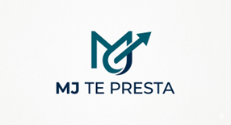

# 💰 MJ TE PRESTA

Sistema Gestor de Préstamos — Universidad de Antioquia  
Facultad de Ingeniería | Curso: Algoritmia y Programación  
Profesora: Cindy Estrada

---

## 👥 Integrantes

| Nombre | Rol | Programa | Semestre |
|---|---|---|---|
| Manuela Bustamante Castrillón | Líder | Ingeniería Industrial | 3° |
| Fabian Saul Jimenez Madera | Desarrollador Backend | Ingeniería Industrial | 3° |
| Miguel Angel López Garcia | Desarrollador Backend | Ingeniería Industrial | 3° |
| Angie Natalia Valencia Castañeda | QA / Documentación | Ingeniería Industrial | 3° |

---

## 🎓 Vínculos Académicos y Descripción

**Manuela Bustamante Castrillón** — Soy estudiante de Ingeniería Industrial con interés en el área de la programación y el desarrollo técnico. Me destaco por mi dominio de la herramienta Python y mi capacidad para aplicarla en la resolución de problemas. En el trabajo colaborativo, aporto habilidades sólidas de liderazgo, facilidad para el trabajo en equipo y una gran capacidad para gestionar y resolver conflictos. Me caracterizo por mi sentido de la responsabilidad y por garantizar la puntualidad en todos los entregables del grupo. 

**Fabian Saul Jimenez Madera** — Estudiante de tercer semestre de Ingeniería Industrial en la Universidad de Antioquia. Poseo experiencia en el desarrollo colaborativo de proyectos, los cuales abordo con un enfoque metodológico y estructurado. Mis fortalezas incluyen la capacidad de análisis cuantitativo, comunicación efectiva y un fuerte compromiso con los objetivos del equipo y el aprendizaje colaborativo. Actualmente, aplico mis fundamentos en Python para la automatización y el diseño de sistemas de control de recursos, además de colaborar en un proyecto de gestión de préstamos.

**Miguel Angel López Garcia** — Soy estudiante de Ingeniería Industrial en la Universidad de Antioquia y tengo interés en el área de programación y desarrollo de sistemas. He participado en el desarrollo colaborativo de proyectos, aportando en la programación estructurada, el manejo de archivos planos y la validación de datos. En el proyecto actual, contribuyo al desarrollo del sistema, siendo responsable de la clase *clsUsuarios* y del módulo de devoluciones y certificados. Me interesa especialmente la lógica aplicada a la resolución de problemas y el trabajo en equipo para cumplir con los objetivos del proyecto.

**Angie Natalia Valencia Castañeda** — Soy estudiante de Ingeniería Industrial de la Universidad de Antioquía, asumo el rol de calidad y documentación del proyecto. Soy responsable del módulo de administración, del manual de usuario y de las pruebas funcionales del sistema. Mis fortalezas son la atención al detalle, la redacción técnica y la capacidad de identificar errores. También apoyo la elaboración del diagrama de Gantt y el cronograma del proyecto. 

---

## 📌 Nombre del Proyecto

**MJ TE PRESTA**

Sistema diseñado para ayudar a MJ a gestionar sus préstamos de artículos (juegos, herramientas, electrodomésticos y más) de forma digital, eliminando el problema del olvido.

---

## 📄 Licencia

[Ver licencia del proyecto](https://docs.google.com/document/d/1TPPEsn0r-WXXDK1196iyZ8XCS37p2OqnW6AvVWt2218/edit?usp=sharing)

---

## 🔭 Reporte de Visión

**MJ TE PRESTA** es un sistema en Python diseñado para que Michael Jackson Gamboa (MJ) administre de forma organizada el préstamo de sus artículos personales a sus amigos. Soluciona la pérdida de objetos y la falta de registros mediante la digitalización del proceso.

**Funcionalidades principales:**
- Registro de usuarios e ítems con códigos únicos
- Gestión de salidas y devoluciones
- Alertas automáticas de cobro a partir del día 20
- Generación de facturas con 23% de impuesto por retrasos mayores a 30 días
- Exportación de datos a CSV
- Trazabilidad completa y respaldo documental

---

## ⚙️ Especificación de Requisitos

### Requisitos Funcionales

**Gestión de Usuarios**
- Registro con nombre, apellido, documento, correo y plazo de préstamo
- Validaciones: nombres mín. 3 caracteres, documento 3–15 dígitos, formato de correo con `@` y `.com`
- Plazos de préstamo: 5, 10, 15 o 30 días

**Gestión de Ítems**
- Registro con nombre, categoría, valor, ID y estado
- Categorías: Videojuegos, Libros, Música y video, Herramientas, Dinero, Misceláneo
- Condición evaluada con lógica difusa: Excelente, Bueno, Regular, Malo

**Gestión de Préstamos**
- Solo para usuarios registrados
- Almacena fecha de inicio, datos del usuario, artículo y plazo
- Alertas automáticas desde el día 20

**Devoluciones y Certificados**
- Solo aplica para préstamos activos
- Verifica ítems pendientes antes de registrar devolución

**Facturación por Venta**
- Conversión automática a venta si el retraso supera 30 días
- Factura con subtotal + 23% de gravamen por demora

**Módulo Administrador**
- Autenticación con credenciales
- Informes de saldos, devoluciones, ventas y perfiles de usuarios

### Requisitos No Funcionales
- **Usabilidad:** Menú en español con mensajes de error descriptivos
- **Persistencia:** Datos en archivos planos `.txt` y `.csv`
- **Escalabilidad:** Soporte para mínimo 100 usuarios y 500 ítems

---

## 📅 Plan de Proyecto

| Actividad | Responsable | S1 (26/05–01/06) | S2 (02/06–08/06) | S3 (09/06–14/06) |
|---|---|:---:|:---:|:---:|
| Acta de entendimiento | Todos | ● | | |
| Acta de colaboración | Todos | ● | | |
| Acta de responsabilidad | Todos | ● | | |
| README y vínculos académicos | Manuela | ● | | |
| Nombre, licencia, reporte de visión | Fabián | ● | | |
| Especificación de requisitos | Miguel Ángel | ● | ● | |
| Plan de proyecto (Gantt) | Natalia | ● | | |
| Plan de versionado | Fabián | | ● | |
| Desarrollo clsUsuario | Manuela | | ● | ● |
| Desarrollo Préstamo | Fabián | | ● | ● |
| Módulo devolución y ventas | Miguel Ángel | | ● | ● |
| Módulo administrador y reportes | Natalia | | ● | ● |
| Manual de usuario | Natalia | | | ● |
| Pruebas y correcciones | Todos | | | ● |
| Entrega final GitHub | Manuela | | | ● |

### 💲 Presupuesto

| Integrante | Horas | Valor/hr | Total |
|---|---|---|---|
| Manuela Bustamante | 12–13 h | $5.682 | $73.866 |
| Fabián Jiménez | 12–13 h | $5.682 | $73.866 |
| Miguel Ángel | 12–13 h | $5.682 | $73.866 |
| Natalia Valencia | 12–13 h | $5.682 | $73.866 |
| **TOTAL** | **50 h** | — | **$284.100** |

---

## 📋 Actas del Proyecto

- [Acta de Entendimiento](Acta de Entendimiento.pdf)
- [Acta de Colaboración](Acta de Colaboración.pdf)
- [Acta de Responsabilidad](Acta de Responsabilidad.pdf)
